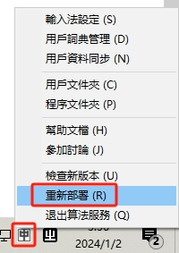

# Ajemi

Ajemi is an IME (input method) for Toki Pona. With proper font support, it allows you to type Sitelen Pona characters with ease. 

## Install Standalone Version

The standalone version is available now. Click link below to download the installer.

[![[DOWNLOAD]](https://img.shields.io/badge/DOWNLOAD-Ajemi--0.1--Setup.exe-blue)](https://github.com/dec32/Ajemi/releases/download/v0.1/Ajemi-0.1-Setup.exe)

## Install with RIME

1. Install [RIME](https://rime.im/)
2. Install the font [Nishiki-teki](https://umihotaru.work/nishiki-teki.zip)
3. Download the zipped [config files](https://github.com/dec32/Ajemi/releases/download/v1.0-rime/Ajemi.zip)
4. Copy all three config files:

    - `ajemi.schema.yaml`
    - `ajemi.dict.yaml`
    - `default.custom.yaml`

   into: `C:/User/{YOUR_ACCOUNT}/AppData/Roaming/Rime`

5. Press WIN + SPACE to switch to RIME and reload it via:

    

P.S. If you are using mac or Linux, copy the config files into:

|Platform                        |Directory                    |
|--------------------------------|-----------------------------|
|macOS                           |`~/Library/Rime`             |
|Linux                           |`~/.config/ibus/rime/`       |
|Linux with ibus 0.9.1 or lower  |`~/.ibus/rime/`              |
|Linux with fcitx5               |`~/.local/share/fcitx5/rime/`|

## Usage

To type a glyph, simply type its spelling, and press SPACE to confirm. 

Suggestions from pop-ups will help you type faster. Press SPACE to accept the highlighted one. Press number keys to pick any of them.

Pressing ENTER will release the raw ASCII text.

To type punctuators, type: 

- `.` for MIDDLE DOT (U+F199C)
- `:` for COLON (U+F199D)
- `<` for LEFT CORNER BRACKET (U+300C)
- `>` for RIGHT CORNER BRACKET (U+300D)

To type control characters, type:

- `-` for ZERO WIDH JOINER (U+200D)
- `+` for STACKING JOINER (U+F1995)
- `=` for SCALING JOINER (U+F1996)
- `(` for START OF LONG GLYPH (U+F1997)
- `)` for END OF LONG GLYPH (U+F1998)
- `{` for START OF REVERSE LONG GLYPH (U+F199A)
- `}` for END OF REVERSE LONG GLYPH (U+F199B)
- `[` for START OF CARTOUCHE (U+F1990)
- `]` for END OF CARTOUCHE (U+F1991)

JOINERs combine adjacent glyphs into a single glyph. LONG GLYPH control characters provide underscores that work well with certain glyphs (especially pi). CARTOUCHE control characters provide cartouches for proper names. Here's a rough demonstration of their behavior:

|Spelling          |Glyph                                    |
|------------------|-----------------------------------------|
|`toki-pona`       |           |
|`toki+pona`       |          |
|`toki=pona`       |           |
|`pi (toki pona)`  |        |
|`{toki-pona} kama`||
|`[toki pona]`     |          |

## Customize

Ajemi relies on RIME, which is a highly customizable input method. Here's a very breif instruction on how to customize a couple of things.

To use a different font for the input method, edit the value of `"style/font_face"` in `weasel.custom.yaml`. Notice that Ameji relies on UCSUR-compliant fonts to function. To find and install such fonts, please visit [this spreadsheet](https://docs.google.com/spreadsheets/d/1xwgTAxwgn4ZAc4DBnHte0cqta1aaxe112Wh1rv9w5Yk/htmlview?gid=1195574771).

To customize the spellings of the glyphs, go to `ajemi.dict.yaml` to edit the mapping. Each glyph and its corresponding spelling are seperated by a TAB character. You can also map a sequence of glyphs to a spelling. That will create a phrase.

To customize punctuators and control characters, edit the `punctuator` section of `ajemi.schema.yaml`.

Remember to reload RIME after editing the config files to deploy the customization.

## Uninstall

1. Run `C:\Program Files (x86)\Rime\weasel-{VERSION}\uninstall.exe`
2. Reboot your device
