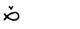
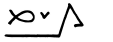

# Ajemi

Ajemi is an IME (input method) for Toki Pona. With proper font support, it allows you to type Sitelen Pona characters with ease. 


## Install


Click link below to download the latest version.

[![[DOWNLOAD]](https://img.shields.io/badge/DOWNLOAD-Ajemi--0.2--Setup.exe-blue)](https://github.com/dec32/Ajemi/releases/download/v0.2/Ajemi-0.2-Setup.exe)


## Usage

Press <kbd>Win</kbd> + <kbd>Space</kbd> or <kbd>Ctr</kbd> + <kbd>Shift</kbd> to switch to the input method.

To type a glyph, simply type its spelling, and press <kbd>Space</kbd> to confirm. 


Suggestions from he candidate list can help you type faster. Press <kbd>Space</kbd> to the commit the highlighted candidate. Press <kbd>1</kbd> ~ <kbd>5</kbd> to pick any of them.


You can also type multiple glyphs in a row. Long glyphs will be automatically injected.


Pressing <kbd>Enter</kbd> releases the raw ASCII text.


To type punctuators, type: 

- `.` for MIDDLE DOT (U+F199C)
- `:` for COLON (U+F199D)
- `<` for LEFT CORNER BRACKET (U+300C)
- `>` for RIGHT CORNER BRACKET (U+300D)

To type control characters, type:

- `-` for ZERO WIDTH JOINER (U+200D)
- `^` for STACKING JOINER (U+F1995)
- `*` for SCALING JOINER (U+F1996)
- `(` for START OF LONG GLYPH (U+F1997)
- `)` for END OF LONG GLYPH (U+F1998)
- `{` for START OF REVERSE LONG GLYPH (U+F199A)
- `}` for END OF REVERSE LONG GLYPH (U+F199B)
- `[` for START OF CARTOUCHE (U+F1990)
- `]` for END OF CARTOUCHE (U+F1991)


JOINERs combine adjacent glyphs into a single glyph. LONG GLYPH control characters provide underscores that work well with certain glyphs (especially pi). CARTOUCHE control characters provide cartouches for proper names. Here's a rough demonstration of their behavior:

|Spelling          |Glyph                                    |
|------------------|-----------------------------------------|
|`toki^pona`       |          |
|`toki*pona`       |           |
|`pi (toki pona)`  |        |
|`{toki-pona} kama`||
|`[toki pona]`     |          |


## Customize

You can customize the appearance of the input method by editing the content of `%APPDATA%/Ajemi/conf.toml`. It looks like this:

```Toml
[font]
name = "sitelen seli kiwen juniko"
size = 20

[layout]
vertical = false

[color]
candidate = 0x000000
index = 0xA0A0A0
background = 0xFAFAFA
clip = 0x0078D7
highlight = 0xE8E8FF
highlighted = 0x000000
```

Notice that Ameji relies on UCSUR-compliant fonts to function. To find and install such fonts, please visit [this spreadsheet](https://docs.google.com/spreadsheets/d/1xwgTAxwgn4ZAc4DBnHte0cqta1aaxe112Wh1rv9w5Yk/htmlview?gid=1195574771).